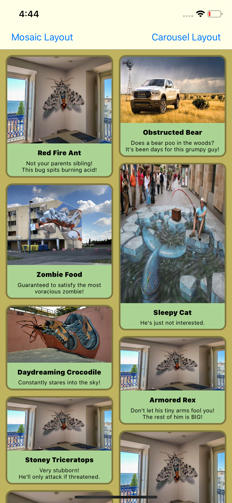

# CustomQueuePlayer
App wrap the SwiftAudio Library in ademo with more controling over AVPlayer to coordinate array of audio messages and playing and pause sequence with many delegates to time and duration 

